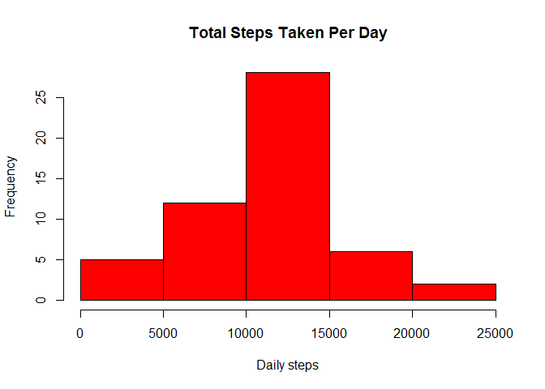
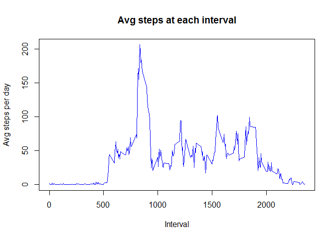
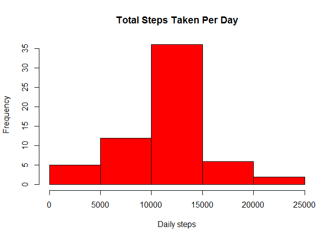
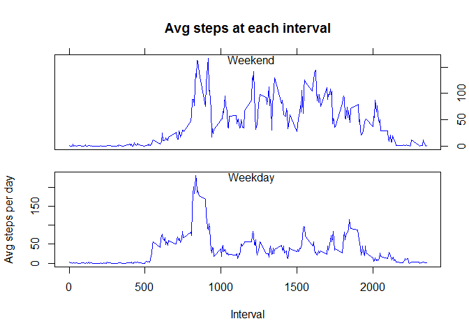

# Reproducible Research: Peer Assessment 1


## Loading and preprocessing the data


```r
columnClasses <- c("numeric", "character", "numeric")
activityData <- read.csv("activity.csv", colClasses = columnClasses)
```

## What is mean total number of steps taken per day?

1. Calculate the total number of steps taken per day.


```r
dailyActivityData <- aggregate(steps ~ date, activityData, sum)
```

2. Histogram of total steps taken per day.


```r
par(mfrow = c(1, 1))
hist(dailyActivityData$steps, main = "Total Steps Taken Per Day", xlab = "Daily steps", col = "red")
```

 

3. Calculate the mean and median


```r
meanSteps <- mean(dailyActivityData$steps, na.rm = TRUE)
medianSteps <- median(dailyActivityData$steps, na.rm = TRUE)
```

Mean number of steps per day is 10,766.19.
Median number of steps per day is 10,765.

## What is the average daily activity pattern?

1. Time series plot of the 5-minute interval vs avg number of steps taken per day.


```r
stepActivityData <- aggregate(steps ~ interval, activityData, mean)
plot(stepActivityData$interval, stepActivityData$steps, type = "l", main = "Avg steps at each interval", xlab = "Interval", ylab = "Avg steps per day", col = "blue")
```

 

2. Which 5-minute interval, on average across all the days in the dataset, contains the maximum number of steps?

Interval 835 has the most number of average steps, 206.1698.

## Imputing missing values

1. Calculate and report the total number of missing values in the dataset


```r
nrow(activityData[is.na(activityData$steps),])
```

```
## [1] 2304
```

2. Impute missing data

Data will be imputed by using the mean for the interval in which the data is missing.  As the data set has missing data for entire days, using the daily avg is not useful since it will not prvoide a value for those days in which data is missing completely.

3. Create a new data set with missing data


```r
naValues <- activityData[is.na(activityData$steps), c("date", "interval")]
assign("imputedActivityData", activityData)
for (naDate in unique(naValues$date)){
    for (naInterval in naValues[naValues$date == naDate, "interval"]){
        imputedActivityData[imputedActivityData$date == naDate & imputedActivityData$interval == naInterval, "steps"] <- stepActivityData[stepActivityData$interval == naInterval, "steps"]
    }
}
```

4. Make a histogram of the total number of steps taken each day and Calculate and report the mean and median total number of steps taken per day.


```r
dailyImputedActivityData <- aggregate(steps ~ date, imputedActivityData, sum)
hist(dailyImputedActivityData$steps, main = "Total Steps Taken Per Day", xlab = "Daily steps", col = "red")
```

 

```r
imputedMeanSteps <- mean(dailyImputedActivityData$steps, na.rm = TRUE)
imputedMedianSteps <- median(dailyImputedActivityData$steps, na.rm = TRUE)
```
Do these values differ from the estimates from the first part of the assignment?

Mean? No, as this was the method used for imputation and the only NAs are NA for an entire day so the daily mean remains the same.  
Mean number of steps per day (after imputting data) is 10,766.19.

Median?  Yes, the median is now equal to the mean.
Median number of steps per day (after imputting data) is 10,766.19.

What is the impact of imputing missing data on the estimates of the total daily number of steps?
Little impact as the mean remains the same.

## Are there differences in activity patterns between weekdays and weekends?

1. Create a new factor variable

```r
typeOfDay <- function(x, ...){
    if (x == "Saturday" | x == "Sunday"){
        "weekend"
    } else {
        "weekday"
    }
}
imputedActivityData$typeOfDay <- sapply(sapply(weekdays(strptime(imputedActivityData[, "date"], "%Y-%m-%d")), typeOfDay), as.factor)
```
2. Panel plot of weekend vs weekday for avg. steps per across intervals


```r
stepActivityData <- aggregate(steps ~ interval + typeOfDay, imputedActivityData, mean)
par(fig = c(0, 1, 0.35, 1))
plot(stepActivityData[stepActivityData$typeOfDay == "weekend", "interval"], stepActivityData[stepActivityData$typeOfDay == "weekend", "steps"], type = "l", main = "Avg steps at each interval", xlab = "", ylab = "", xaxt = "n", axes = FALSE, col = "blue")
axis(3, labels = FALSE)
axis(4)
box()
text(1200, 165, "Weekend")
par(fig = c(0, 1, 0, 0.65), new = TRUE)
plot(stepActivityData[stepActivityData$typeOfDay == "weekday", "interval"], stepActivityData[stepActivityData$typeOfDay == "weekday", "steps"], type = "l", main = "", xlab = "Interval", ylab = "Avg steps per day", col = "blue")
text(1200, 225, "Weekday")
```

 
